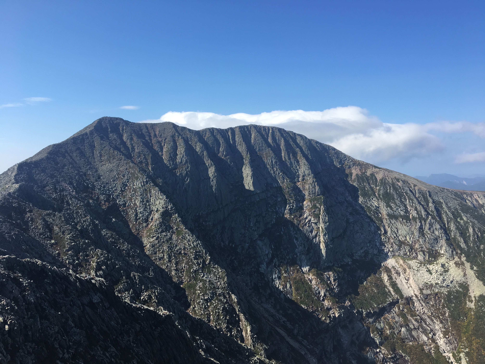

When planning my trip to Acadia, it occurred to me that Maine was also the state where the Appalachian Trail (AT) ended. The AT had always been special to my family: I spent many weekends exploring segments with my dad and, when he was kid, his father had owned a small vacation property along the trail in the mountains. Summer evenings were spent around campfires and sleeping inside a small hut that my grandfather had built from nearby stones. According to my dad, it was where my grandfather was happiest.

I decided to extend my trip to Baxter State Park, the home of Mount Katahdin, which is the tallest mountain in Maine (elevation 5,267 feet) and the northern terminus of the AT. When I arrived at the park, I paid $12 to camp in a small log cabin with wooden beds and a wood burning stove. The ranger at the campsite was an older woman named Betsy, who said that my last name sounded like Italian cuisine.

“Did you know this is moose country?” she said. “Drivers get stuck behind 'em on the road, but we haven't seen many this year because of the logging. This camp sits on the edge of the park, and on the other side is paper country.”

After arranging my gear in the cabin, I went for a run along the dirt road that circled the park. No moose. About two miles from the campgrounds, I came across an opening with a fast-flowing creek. I knelt and washed my face with the cool water, my first “bath” in days. I then sat there for a few minutes, looking at my surroundings and the hazy mountains obscured in the horizon.

Upon returning to the cabin, I arranged dinner and ate alone at a wooden table situated on the border of a large field, where black bears allegedly congregate at night. The sun was radiating a golden warmth that blanketed the valley. I ruminated in a relaxing calm, but, for some reason, this meal felt lonelier than the others. Maybe it was the couple I'd met earlier, who were camping in the cabin next door.

Fortunately, it turned out that I would share the cabin that night with two guys from Boston, Kyle and Will. After they arrived and got settled, we all sat outside around a fire and started sharing stories. Will had just returned from a five-month stint in Alaska where he worked as a bear guide. His job was to bring tourists to see Grizzly Bears in the wild. This year he would be starting college to study snow science, with the hope of becoming a ski instructor at some of the more avalanche-prone slopes in the Midwest. Kyle, who was a bit shorter than Will, stocky, and spoke with a thick Boston accent, showed me several pictures of himself cliff jumping. Kyle was a decent photographer, and, for a short time, he and a friend were sponsored by Sperry to take pictures of themselves cliff jumping across the country. Some of the cliffs were upwards of 80 feet high. Feeling outclassed, I told them about the time Bret and I hitchhiked across three states to reach the Grand Canyon.

As I had expected, the stars that night were magnificent, an even better showing than at Acadia. No words can describe all the colors—the brilliant white of stars and dark, pinkish purples of nebulae—and complex geometries that filled the sky. With the help of a phone app, Kyle and I were able to locate several constellations.

For me, sleep that night was brutal. The uninsulated cabin walls let most of the heat escape, and I was once again battling the frigid Maine temperatures. Not to mention that the cots were made of solid wood and quite uncomfortable, even with a sleeping bag. Still, this was a significant upgrade from the tent. Will had tried to “cowboy it,” meaning to sleep outside under the stars. I warned him about the bears out in the field, but he seemed not very concerned. He carried a taser just in case—the sound apparently known to scare bears away. But despite being prepared for bears, he was not expecting the nighttime dew, which coated him in a dense humidity; he eventually decided to relocate inside.

Kyle and Will left the cabin around 4:30 am. It would take them close to an hour to drive to a trailhead on the other side of Mount Katahdin. I left shortly after and parked in a small, graveled lot near the AT. At 6:26 am, I wrote down my name on the hiking log—required for the rangers to keep record—and began the five-mile climb. The trail quickly transitioned from an inclined walkway to a bouldering path, and then an all-out rock climb. In no time, I was hanging on the side of Katahdin, fighting against the aggressive wind. Along the way, I met a man and woman who were thru-hikers on the last leg of their journey. They had started the AT in Georgia, during April, and were now closing in on the finish. The three of us climbed together for a while. Eventually, we reached a minor peak and could see the mountain summit beckoning in the distance.

At the top, I took a photo standing behind the sign denoting the “northern terminus” of the AT. From this point, I expected an easy descent back to the parking lot, but ahead loomed an ominous ridge line called The Knife's Edge. Little specs of people could be seen dispersed across the ridge, balancing with poles. To cross the Knife's Edge, one must walk a mile at an elevation of 5,000 feet, along a bouldering path that averages about eight feet in width. At various points, the path narrows to a much shorter distance. The elevation prevents any foliage from growing, leaving barren rocks that add another dark dimension to the scene. Apparently, professional mountaineers scale the ridge in the winter to prepare for summiting Everest. It took me an hour to cover that mile, and I have no shame admitting that I crawled at the slimmest portions.

After crossing, I discovered that the trail to loop back had suffered a mud slide and was closed indefinitely. To return to my car would require another 12 miles of hiking and bouldering—I had no desire to cross the Knife's Edge a second time—and I had run out of water, a rookie mistake. To make matters worse, there were only about six hours of daylight remaining.

My plan was to attempt the 12 miles, covering the trails as fast as possible. However, climbing down the mountain proved almost as challenging as its ascent. I was exhausted and dehydrated. Realizing the extent of my predicament, I decided to hike down to the nearest parking lot and attempt to hitch a ride to my car.

Upon reaching the lot, I came across a man who was walking towards a white pickup. “Excuse me, I got stranded on the wrong side of the mountain. Could you give me a ride to the Abol campgrounds?” He hesitated for a moment, but ultimately agreed since, fortunately, it would be close to where his son was hiking. We drove slowly along the dirt road for about six miles and struck up conversation. As it turned out, Jim was raised in Alabama and studied architecture at SUNY Buffalo. He moved to Maine with his family about 15 years ago and has since become a regular visitor at Baxter. Jim refused to accept any money offered. We shook hands and parted.

I was finally back where I started. It was now close to four in the afternoon, about nine hours after I entered the AT. I had a long drive ahead, but before leaving, I walked back to the trail and noted on the log that I had returned. Then, I took a shot of whiskey from my flask and poured some out on the trail for my grandfather.
